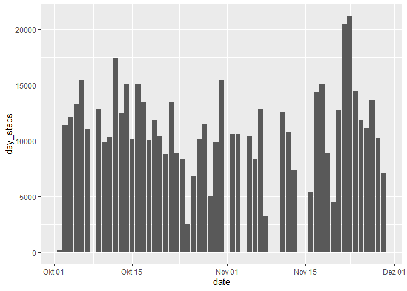
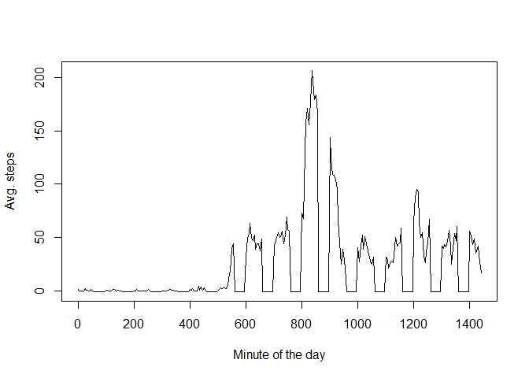
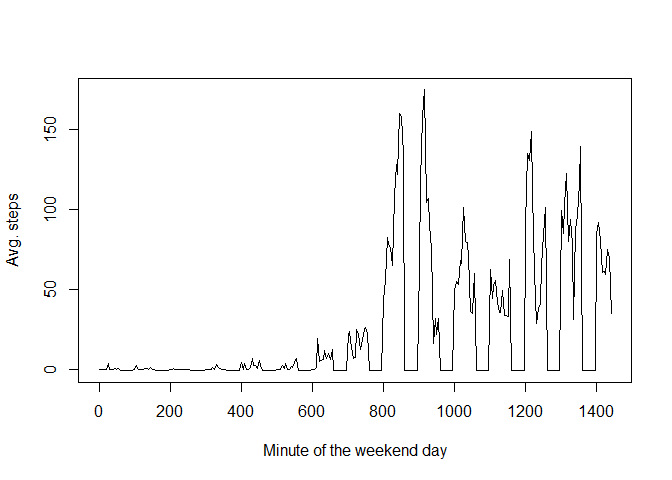
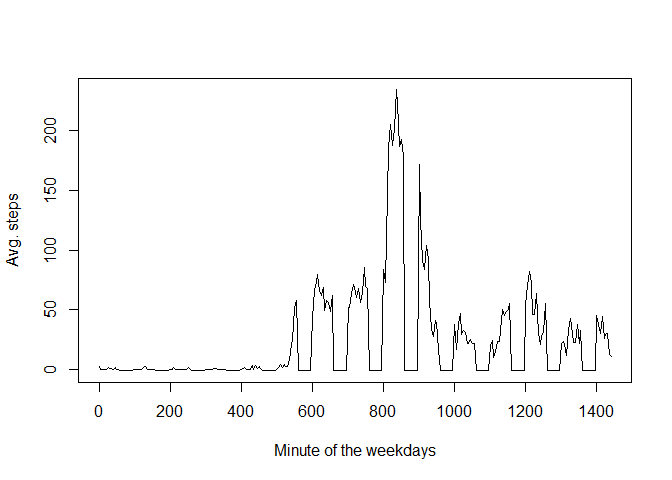

## Loading and preprocessing the data
After unzipping the activity data, looking into the csv with a text editor shows this syntax:  
***
"steps","date","interval"  
NA,"2012-10-01",0  
***
For loading data like that *read_csv()* in the *readr* package is perfect, which is here loaded as part of the *tidyverse* library.

```r
library(tidyverse)
```

```
## Warning: package 'tidyverse' was built under R version 3.6.2
```

```
## -- Attaching packages ------------------------------------------------------ tidyverse 1.3.0 --
```

```
## v ggplot2 3.2.1     v purrr   0.3.3
## v tibble  2.1.3     v dplyr   0.8.3
## v tidyr   1.0.0     v stringr 1.4.0
## v readr   1.3.1     v forcats 0.4.0
```

```
## Warning: package 'tidyr' was built under R version 3.6.2
```

```
## Warning: package 'readr' was built under R version 3.6.2
```

```
## Warning: package 'forcats' was built under R version 3.6.2
```

```
## -- Conflicts --------------------------------------------------------- tidyverse_conflicts() --
## x dplyr::filter() masks stats::filter()
## x dplyr::lag()    masks stats::lag()
```

```r
activity <- read_csv("activity.csv")
```

```
## Parsed with column specification:
## cols(
##   steps = col_double(),
##   date = col_date(format = ""),
##   interval = col_double()
## )
```
Let's see how much data we got and an first assessment of the values:

```r
dim(activity)
```

```
## [1] 17568     3
```

```r
summary(activity)
```

```
##      steps             date               interval     
##  Min.   :  0.00   Min.   :2012-10-01   Min.   :   0.0  
##  1st Qu.:  0.00   1st Qu.:2012-10-16   1st Qu.: 588.8  
##  Median :  0.00   Median :2012-10-31   Median :1177.5  
##  Mean   : 37.38   Mean   :2012-10-31   Mean   :1177.5  
##  3rd Qu.: 12.00   3rd Qu.:2012-11-15   3rd Qu.:1766.2  
##  Max.   :806.00   Max.   :2012-11-30   Max.   :2355.0  
##  NA's   :2304
```
For the steps NA values ref. below in section "Imputing missing values". As the median of this variable is 0, we can expect most of the entries being zero, i.e. the person not moving more than half of the time reported.


## What is mean total number of steps taken per day?
This can easily be answered by computing the mean after grouping and summing up the steps by day. Special care need the NA values, which need to be neglected computing the mean, after they are automaticaly not taken into account in the daily sums. 

```r
daily_activity <- group_by(activity, date)
daily_steps_totals <- summarize(daily_activity, day_steps = sum(steps))
ggplot(daily_steps_totals, aes(date, day_steps)) + geom_col()
```

```
## Warning: Removed 8 rows containing missing values (position_stack).
```

<!-- -->

```r
daily_steps_mean <- mean(daily_steps_totals$day_steps, na.rm = TRUE)
daily_steps_median <- median(daily_steps_totals$day_steps, na.rm = TRUE)
```
The mean total number of steps taken per day is (rounded to natural number) 10766, the median is 10765.


## What is the average daily activity pattern?
Unfortunately taking the same approach again, this time grouping by the intervals, seems not to work due to limitation of the grouping mechanism. So the next best idea is collecting the means per interval into a vector

```r
interval_means <- vector()
for(i_interval in seq(0, 24*60, by = 5))
    interval_means <- c(interval_means, 
                        summarize(filter(activity, interval == i_interval), 
                                  mean(steps, na.rm = TRUE)))
```
Notably this vector has 289 entries and so much more than activity has unique entries (288). Obviously some intervals were not reported at all. An inspection of the unique values shows that e.g. no intervals between 55 and 100 are present.
This is what this average daily pattern looks like. For the missing intervals (NaN in the vector) we use -1 as flag in this histogram:

```r
interval_plots <- vector()
for(i in seq(1, (24*60)/5+1)){
    if (is.nan(unlist(interval_means[i]))) 
      plot_value <- -1 
    else plot_value <- interval_means[i]
    interval_plots <- c(interval_plots, plot_value)
}
interval_means_plot <- tibble(interval = seq(0, 24*60, by = 5), avg_steps = interval_plots)
plot(interval_means_plot$interval, interval_means_plot$avg_steps, type = "l", 
     xlab = "Minute of the day", ylab = "Avg. steps")
```

<!-- -->

Obviously there are long intermittent periods without data, which is the motivation and challenge of the next section.

## Imputing missing values
Based on 

```r
intervals_missing <- filter(activity, is.na(activity$steps))
intervals_missing <- rename(intervals_missing, interval_NA = interval) # rename for later differentiation
intervals_missing <- rename(intervals_missing, date_NA = date) # rename for later differentiation
```
the amount of intervals missing values, i.e. being NA, is: 2304.

As stated in the previous section there are no mean values for a lot of intervals. In addition not every day has a steps total due to the missing values. Therefore the NAs are going to be imputed by the daily steps mean divided by the amount of interval per day (= 289).

```r
imput_steps <- function(steps){
  head(steps)
  if (is.na(steps)) (daily_steps_mean / 289) else steps
}
activity_imputed <- mutate(activity, steps = sapply(activity$steps, imput_steps))
```
4. Let's redo the plotting and calculation of the **mean** and **median** total number of steps taken per day on the imputed data set. 

```r
daily_activity_imputed <- group_by(activity_imputed, date)
daily_steps_imputed_totals <- summarize(daily_activity_imputed, day_steps = sum(steps))
ggplot(daily_steps_imputed_totals, aes(date, day_steps)) + geom_col()
```

<!-- -->

```r
daily_steps_imputed_mean <- mean(daily_steps_imputed_totals$day_steps, na.rm = TRUE)
daily_steps_imputed_median <- median(daily_steps_imputed_totals$day_steps, na.rm = TRUE)
```
The mean total number of steps taken per day in the imputed data set is 10761, the median is 10729 (also rounded to natural number). Both are roughly 400-500 steps lower than in the original data. This seems to be a consquence of the low amounts of steps at the begin and end of the complete period, which led to a low average amount of steps per interval.

## Are there differences in activity patterns between weekdays and weekends?
First we need to add a new factor variable in the dataset with two levels -- "weekday" and "weekend" indicating whether a given date is a weekday or weekend day.

```r
library(lubridate)
```

```
## Warning: package 'lubridate' was built under R version 3.6.2
```

```
## 
## Attaching package: 'lubridate'
```

```
## The following object is masked from 'package:base':
## 
##     date
```

```r
weekday_weekend <- function(date){
  if (wday(date) == 1 | wday(date) == 7) "weekend" else "weekday"
}
activity <- mutate(activity, weekday_weekend = sapply(activity$date, weekday_weekend))
```
Based on that the patterns for both groups of days can be plotted. First weekend:

```r
interval_means_weekend <- vector()
for(i_interval in seq(0, 24*60, by = 5))
    interval_means_weekend <- c(interval_means_weekend, 
                                summarize(filter(activity, 
                                                 interval == i_interval, weekday_weekend == "weekend"),
                                          mean(steps, na.rm = TRUE)))

interval_plots_weekend <- vector()
for(i in seq(1, (24*60)/5+1)){
    if (is.nan(unlist(interval_means_weekend[i]))) 
      plot_value <- -1 
    else plot_value <- interval_means_weekend[i]
    interval_plots_weekend <- c(interval_plots_weekend, plot_value)
}

interval_means_weekend_plot <- tibble(interval = seq(0, 24*60, by = 5), 
                                      avg_steps = interval_plots_weekend)
plot(interval_means_weekend_plot$interval, interval_means_weekend_plot$avg_steps, type = "l", 
     xlab = "Minute of the weekend day", ylab = "Avg. steps")
```

<!-- -->

Then weekdays:

```r
interval_means_weekday <- vector()
for(i_interval in seq(0, 24*60, by = 5))
    interval_means_weekday <- c(interval_means_weekday, 
                                summarize(filter(activity, 
                                                 interval == i_interval, weekday_weekend == "weekday"),
                                          mean(steps, na.rm = TRUE)))

interval_plots_weekday <- vector()
for(i in seq(1, (24*60)/5+1)){
    if (is.nan(unlist(interval_means_weekday[i]))) 
      plot_value <- -1 
    else plot_value <- interval_means_weekday[i]
    interval_plots_weekday <- c(interval_plots_weekday, plot_value)
}

interval_means_weekday_plot <- tibble(interval = seq(0, 24*60, by = 5), 
                                      avg_steps = interval_plots_weekday)
plot(interval_means_weekday_plot$interval, interval_means_weekday_plot$avg_steps, type = "l", 
     xlab = "Minute of the weekdays", ylab = "Avg. steps")
```

<!-- -->

So the patterns differ significantly as the on weekdays the maximum activity is in the middle of the day, while on weekends is lower before that and higher after that. So the second half of the weekend day the person meassured seems to be more constantly on the move, while on weekday it drops below that level in that period. It could be working on weekdays moving mostly around noon, while starting slow on weekends and having an active afternoon and evening.
